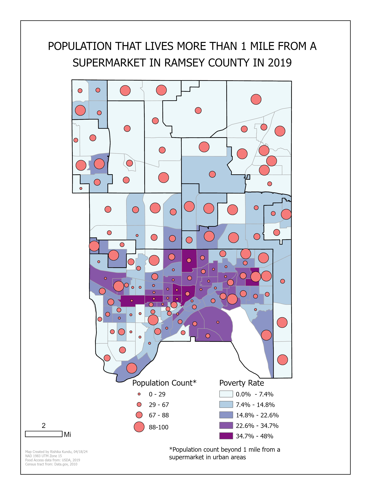

# Food-Accessibility-ArcGIS-Map

**Food Insecurity in Ramsey County**

**Project Overview**
The goal of this project was to identify populations in Ramsey County, Minnesota, that lived more than a mile away from supermarkets and to explore whether there was a correlation between supermarket accessibility and neighborhood income levels. This analysis used data from the U.S. Department of Agriculture's Food Access Research Atlas (FARA) and 2010 Census TIGER/Line shapefiles.

**The following map was produced using ArcGIS for this project:**

**Data Sources:**
* FARA: Population data based on proximity to supermarkets.
* 2010 TIGER/Line Shapefiles: Minnesota census tract boundaries.

**Methodology:** 
* Filtered the FARA dataset for Ramsey County using the Select by Attribute tool.
* Joined FARA data with 2010 census tract shapefiles.
* Mapped:
*   Graduated Symbols: People living >1 mile from supermarkets.
*   Choropleth Map: Income levels by census tract.

**Findings:**
* No clear correlation was found between supermarket inaccessibility and income levels, indicating food insecurity requires broader, more complex analysis.

**Things i learned:**
* Geoprocessing Skills: Gained experience filtering, joining, and preparing spatial data for analysis.
* Spatial Visualization: Developed thematic maps to clearly present geographic patterns.
* Map Visual Hierarchy: Improved skills in organizing map elements to create a clear visual narrative.
* Food Insecurity Complexity: Understood that food insecurity extends beyond supermarket proximity and income levels.
